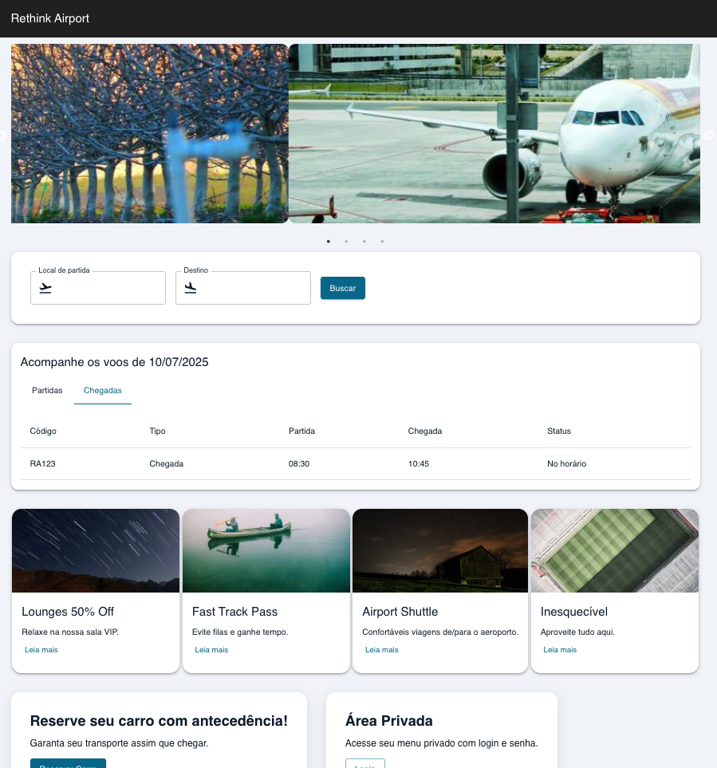

# Rethink Airport Frontend

Parabéns! Se você recebeu este teste confiamos no potencial do seu trabalho e estamos ansiosos para ver como você se sai tecnicamente neste desafio.

Este projeto é um **teste técnico** para desenvolvedores com experiência em Strapi.
O candidato deverá remover os dados mockados e integrar o frontend a uma API Strapi real.

## Objetivos do Teste

- Consumir endpoints do Strapi para obter os dados do site.
- Garantir que a seleção de abas (Partidas/Chegadas) continue funcionando corretamente.
- Manter a estilização e componentes existentes.
- Substituir o mock dos componentes PromotionSection, Footer e CarReservation por requisições reais ao Strapi.

## Rodando o Front-End

- Faça um fork deste repositório.
- Instale as dependências com npm i
- Rode o projeto com npm start
- Observe a homepage com atenção

## Instruções

1. **Configurar Strapi**: Crie um projeto Strapi (em repositório apartado), configure-o na porta padrão e crie os single-types e collection-types necessários para cobrir:

- Os dados globais do site como título, footer, descrição;
- O slider da homepage (ImageSlider) recebendo no mínimo 2 e no máximo 6 imagens;
- Os dados de voos, substituindo o serviço flightService.js pela requisição real;
- Os cards de promoção (PromotionSection) recebendo no máximo 4 cards;
- O componente CarReservationBanner deve ser um componente strapi, ou seja, eu devo conseguir incluí-lo ou retirá-lo da homepage colocando o bloco "CarReservationBanner" vinculado a homepage;

2. **Substitua os mocks pelo serviço real**;
3. **Deixe um .env-example com as configurações para apontamento da API**;
4. **Envie os dois repositórios: strapi + fork do frontend devidamente documentado;**

5. ⭐⭐**PLUS** ⭐⭐- O que você pode entregar além do solicitado acima que vai nos impressionar de verdade:

- 1: Fazer o componente QuickSearch funcionar refletindo no componente FlightStatus;

- 2: Há uma rota de login, para este plus você deverá cadastrar uma rota protegida que somente será acessível por usuários da role Authenticated, tanto na API quanto no FrontEnd. Na página restrita, coloque o nome do usuário logado e o email dele para validar a informação;

- 3: Dockerize o strapi;

## Sucesso no teste!
